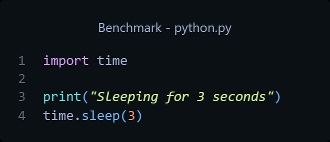
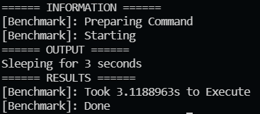

# benchmark
Download and Build (or download the latest release), put it in a folder, and add it to `%PATH%`.

While coding something you can run `benchmark ./myProgram.py` or `benchmark ./myProgram.js` to record the time it takes to run.

# Example
## Code:
### 
## Output:
### 

# LICENSE

This program is free software: you can redistribute it and/or modify
it under the terms of the [GNU General Public License](https://github.com/NeutronX-dev/ws.js/blob/main/LICENSE) as published by
the Free Software Foundation, either version 3 of the License, or
(at your option) any later version.

This program is distributed in the hope that it will be useful,
but WITHOUT ANY WARRANTY; without even the implied warranty of
MERCHANTABILITY or FITNESS FOR A PARTICULAR PURPOSE. See the
GNU General Public License for more details.

You should have received a copy of the GNU General Public License
along with this program. If not, see <https://www.gnu.org/licenses/>.
